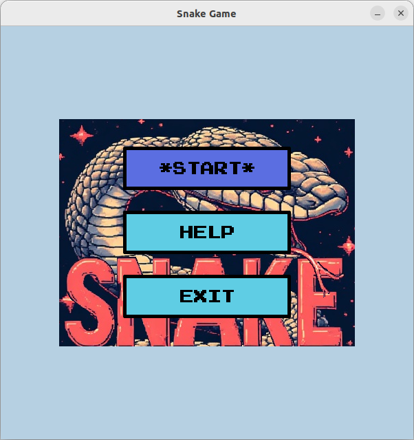
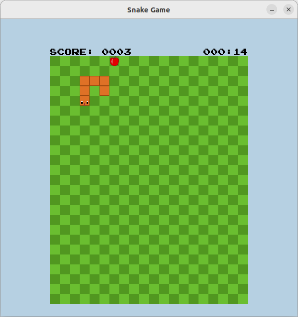
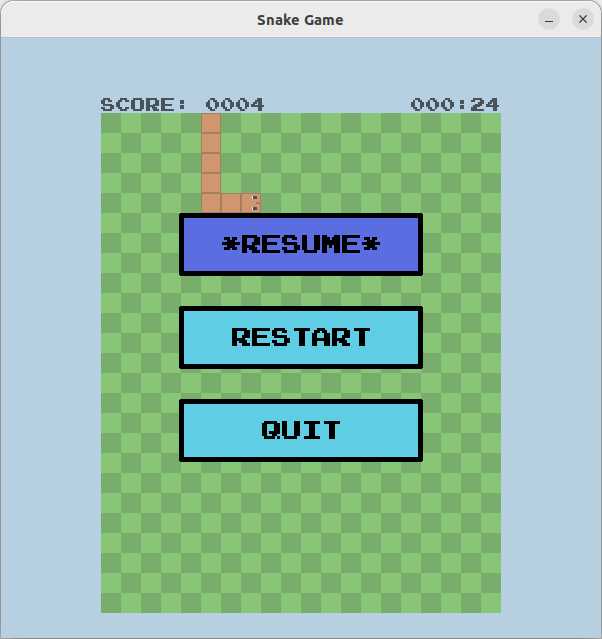

# Snake Game (C++ / SDL)

A classic Snake game implemented in **C++** using the **SDL** library.  
The game features a graphical start menu, sound effects, score and time display, and full game control including pause and restart functionality.

---

## Screenshots

  
  
  

---

## Features

- Implemented in **C++**
- Built using **SDL**
- Start menu with button navigation
- Sound effects for:
  - Menu navigation
  - Snake movement
  - Eating the apple
- Real-time score display
- Game timer
- Pause functionality
- Restart game option
- Smooth movement and collision detection

---

## Controls

| Key  | Action                  |
|-----|-------------------------|
| W A S D | Move snake          |
| Enter | Select menu buttons   |
| Esc   | Pause / Resume game   |

---

## Requirements

- C++17 or newer
- SDL2
- SDL2_image
- SDL2_mixer
- SDL2_ttf
- CMake

